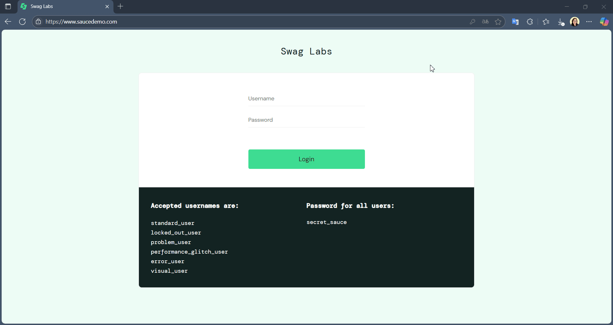

# Casos de teste

## Funcionalidade: Tela de Produtos

 

| CT-09                | Ordenando produtos pelo nome (A - Z)                                                             |
| -------------------- | :----------------------------------------------------------------------------------------------- |
| Pré-condições        | Usuário está autenticado (logado) no sistema com o usuário `problem_user` e senha `secret_sauce` |
| Passo a passo        | 1-Acessar tela de produtos (URL: https://www.saucedemo.com/inventory.html)                       |
|                      | 2-Clicar no campo de seleção no canto superior à direita                                         |
|                      | 3-Clicar na opção `Name (A to Z)`                                                                |
| Resultado esperado   | Produtos ficam ordenados em ordem alfabética ascendente                                          |
| Suite de teste       | Tela de produtos                                                                                 |
| Ambiente de teste    | Web - Navegador Edge Versão 138.0.3351.55 (Compilação oficial) (64 bits) - Windows 11            |
| Resultado encontrado | O mesmo que o resultado esperado                                                                 |
| Status               | ✅ Passou                                                                                        |

 
 

| CT-09                | Ordenando produtos pelo nome (Z - A)                                                                      |
| -------------------- | :-------------------------------------------------------------------------------------------------------- |
| Pré-condições        | Usuário está autenticado (logado) no sistema com o usuário `problem_user` e senha `secret_sauce`          |
| Passo a passo        | 1-Acessar tela de produtos (URL: https://www.saucedemo.com/inventory.html)                                |
|                      | 2-Clicar no campo de seleção no canto superior à direita                                                  |
|                      | 3-Clicar na opção `Name (Z to A)`                                                                         |
| Resultado esperado   | Produtos ficam ordenados em ordem alfabética decrescente                                                  |
| Suite de teste       | Tela de produtos                                                                                          |
| Ambiente de teste    | Web - Navegador Edge Versão 138.0.3351.55 (Compilação oficial) (64 bits) - Windows 11                     |
| Resultado encontrado | A opção `Name (Z to A)` não fica selecionada e produtos não são ordenados na ordem alfabética decrescente |
| Status               | ❌ Falhou                                                                                                 |
| Evidência            |                                                            |
